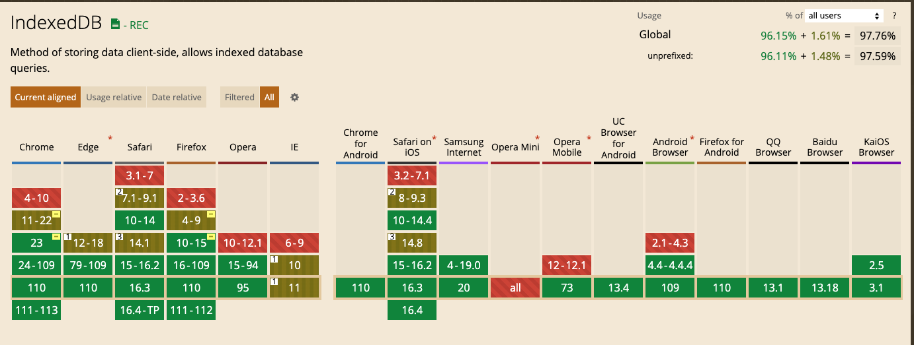
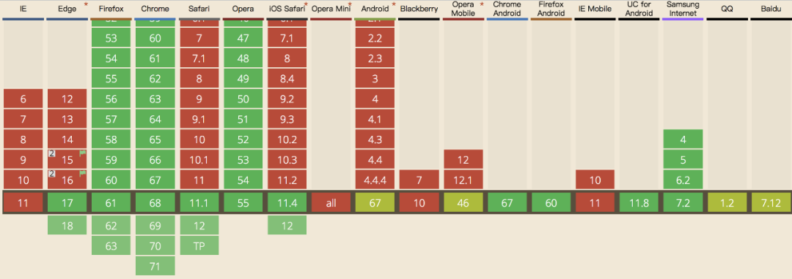
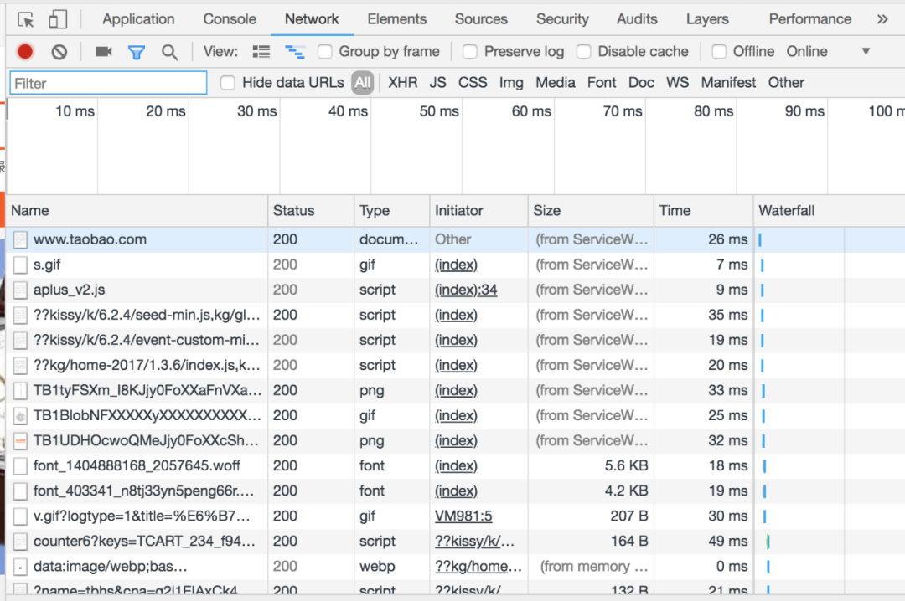
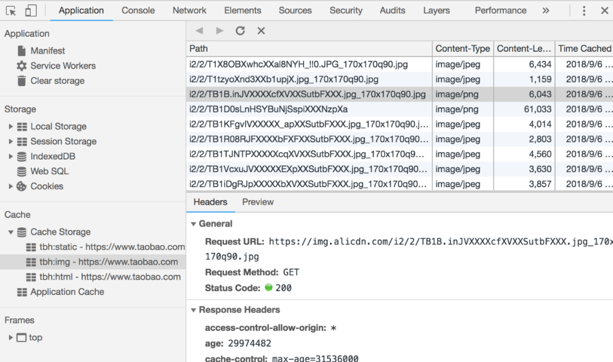

# 前端缓存调研

## 一 动机

在当前项目开发中，会出现许多接口重复调用的情况，产生不必要的资源消耗。组内讨论后，决定在前端添加数据缓存

## 二 背景

前端常用的缓存分为同步缓存和异步缓存。常用的缓存方式有`localStorage`、`sessionStorage`、`cookie`、`indexedDB`、`service Worker`


### storage缓存

简单的缓存方式有cookie，localStorage、sessionStorage，但最大存储容量只有**5MB**，如果缓存的数据较多时，容易出现内存泄漏


### 前端数据库

前端数据库有WebSql和IndexDB，其中WebSql被规范废弃，他们都有大约50MB的最大容量，可以理解为localStorage的加强版

**indexDB兼容性**



**indexDB优缺点**

优点

1. 异步缓存
2. 存储容量50MB，可以满足接口缓存要求
3. 兼容性良好
4. 可支持存储对象、数组等数据类型
5. 存储数据的时候不需要进行数据序列话

缺点

1. 异步缓存，数据需要在.then中获取
2. 不同浏览器中indexDB版本有差异化


**解决方案**

1. 使用`localforage`插件，解决indexDB兼容问题，并且支持优雅降级，在不支持indexDB的情况下，会使用localStorage存储

使项目的类型相似，也存在一些细微的差异。


### 应用缓存

浏览器端常用的应用缓存有`service worker`

**实现原理**

1. 后台线程：独立于当前网页线程
2. 网络代理：在网页发起请求时代理，来缓存文件

**兼容性**



**成熟度**

1. 淘宝
2. 网易新闻
3. 考拉







**使用条件**

sw 是基于 **HTTPS** 的，因为Service Worker中涉及到请求拦截，所以必须使用HTTPS协议来保障安全。如果是本地调试的话，localhost是可以的。

## 三 方案选择

### 方案对比

1. `service worker`多用于脚本、图片资源等大资源缓存，当前做的前端缓存主要是用于web浏览器接口数据缓存，用`localforage`更适合当前的场景
2. `service worker`需要先进行注册，包含多个生命周期，使用相对复杂，`localforage`主要使用的api包含三个，setItem, getItem, removeItem

综上，最后选择`localforage`进行数据缓存


### 缓存要求

1. 支持区分不同用户接口缓存
2. 请求某个接口，支持覆盖更新缓存和清除非当前用户的该接口缓存数据
3. 调用接口时，先判断缓存数据，无指定缓存才请求接口


### 实现思路

**封装request方法**

二次封装`request`请求方法 `generateDataCache`方法，支持是否缓存，缓存时间操作

```js
import request from "@/utils/request"
import {
  getCacheItem,
  generateReqKey,
  setCacheItem,
  getNowTime,
  cleanCacheItem
} from "../commonFuns"

/**
 * 请求拦截
 * @param config
 * @returns {Promise<*>}
 */
export async function requestInterceptor(config) {
  // 开启缓存则保存请求结果
  if (config.cache) {
    let data = await getCacheItem(generateReqKey(config))
    // 记录缓存时间
    let setExpireTime
    if (config.setExpireTime) {
      setExpireTime = config.setExpireTime
    }

    // 判断缓存数据是否存在 存在的话 是否过期 没过期就返回
    if (data && getNowTime() - data.expire < setExpireTime) {
      return data.data
    }
  }
}

/**
 * 响应拦截
 * @param config
 * @param res
 */
export function responseInterceptor(config, res) {
  // 返回的code === 200 时候才会缓存下来
  if (config && config.cache && res.code === 20000) {
    let data = {expire: getNowTime(), data: res}
    let key = generateReqKey(config)
    setCacheItem(key, data)
    // todo:清除非当前用户的相同接口的数据
    cleanCacheItem(config)
  }
}

/**
 * 生成缓存数据
 * @param {Object} requestConfig 请求数据配置
 * @returns {Promise<unknown>}
 */
export async function generateDataCache(requestConfig) {
  let cacheData = await requestInterceptor(requestConfig)
  // 有缓存数据，且未过期，直接走缓存
  if (cacheData) {
    return cacheData
  }
  let res = await request(requestConfig)
  // 缓存数据
  responseInterceptor(requestConfig, res)
  // 返回接口数据
  return res
}

```

**调用缓存方法**

```js
export function getArticle(data) {
  return generateDataCache({
    url: '/article/list',
    method: 'get',
    params: data,
    cache: true,
    setExpireTime: 300000
  })
}
```

**工具类方法**

[公共类方法抽离](https://github.com/btWin9527/vue-admin/blob/dev/src/utils/commonFuns.js)


### 依赖资源

1. `localforage`插件 [indexDB封装插件]
2. `Qs`插件 [ 将对象或者数组序列化成 URL 的格式(a=b&c=d),生成唯一key]


```shell
# 若localforage安装失败，可以直接引入min.js资源文件
npm i localforage Qs -save
```

## 四 参考链接

1. [service worker使用教程](https://mp.weixin.qq.com/s/3Ep5pJULvP7WHJvVJNDV-g)
2. [localforage官网](https://localforage.docschina.org/)