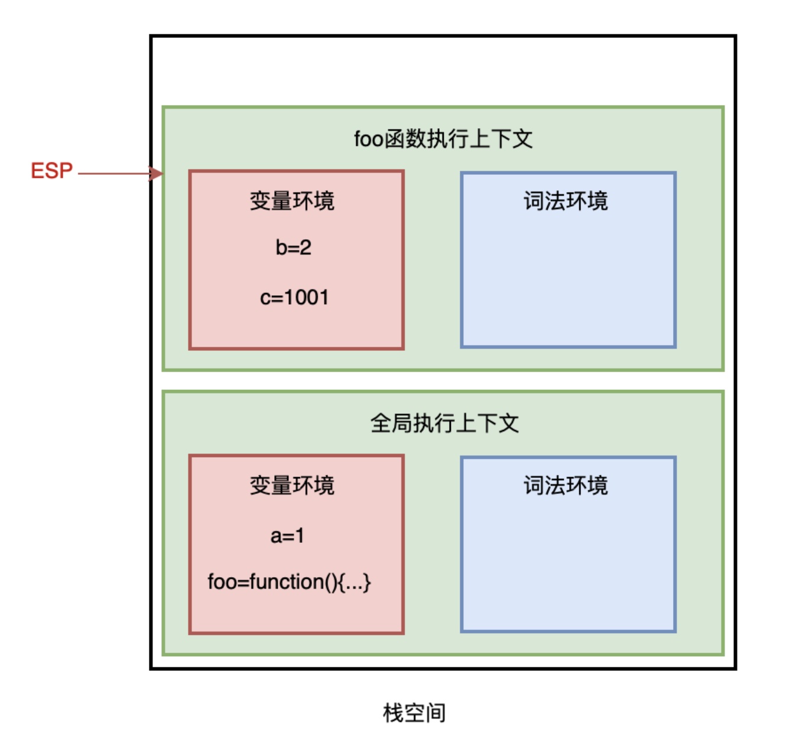
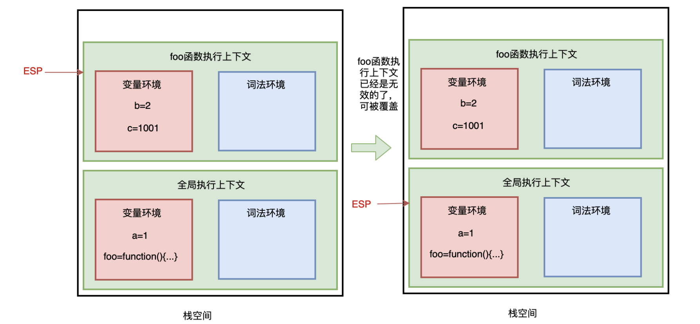
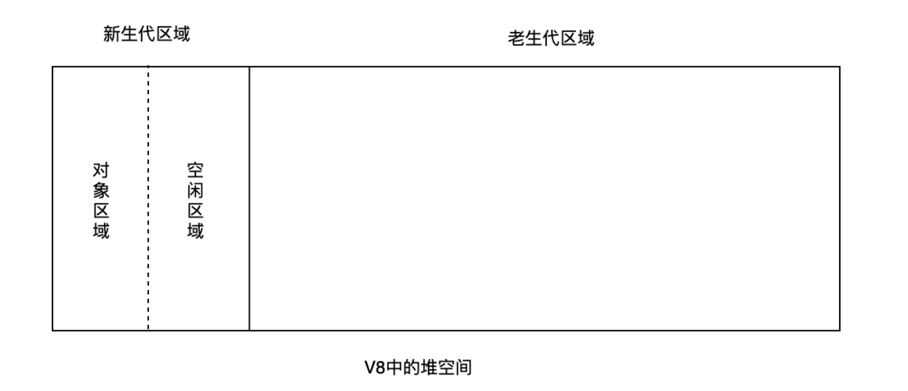

# 垃圾回收

> js中垃圾数据都是由垃圾回收器自动回收的，不需要手动释放。

## 回收栈空间

在js执行代码时，主线程会存在ESP指针，用来指向调用栈中当前正在执行的上下文。

当`foo`函数执行完成后，ESP向下指向全局指向上下文，此时需销毁`foo`函数。

当ESP指针指向全局上下文，`foo`函数执行上下文已经是无效的，当有新的执行上下文进来时，可以直接覆盖这块内存空间

即：**js引擎通过向下移动ESP指针来销毁存放在栈空间中的执行上下文**

## 回收堆空间

V8中堆分成新生代与老生代两个区域：

+ 新生代：用来存放生存周期较短的小对象，一般只支持1~8M的容量
+ 老生代：用来存放生存周期较长的对象或大对象

V8对这两块使用不同的回收器：

+ 新生代使用副垃圾回收器
+ 新生代使用主垃圾回收器

垃圾回收器相同的散步流程：

+ **标记**：标记堆空间中的活动对象（正在使用）或非活动对象（可回收）
+ **垃圾清理**：回收非活动对象所占用的内存空间
+ **内存整理**：当进行频繁的垃圾回收时，内存中可能存在大量不连续的内存碎片，当需要分配一个需要占用较大连续内存空间的对象时，可能存在内存不足的现象。这时需要整理这些内存碎片

### 副垃圾回收器

采用 Scavenge 算法(`即把新生代空间对半划分为两个区域，一半是对象区域，一半是空闲区域`)及对象晋升策略来进行垃圾回收

新加入的对象都加入对象区域，当对象区满的时候，就执行一次垃圾回收，执行流程如下:

+ 标记:首先要对区域内的对象进行标记(活动对象、非活动对象)
+ 垃圾清理:然后进行垃圾清理:将对象区的活动对象复制到空闲区域，并进行有序的排列，当复制完成后，对象区域与空闲区域进行翻转，空闲区域晋升为对象区域，对象区域为空闲区域翻转后，对象区域是没有碎片的，此时不需要进行第三步

但，新生代区域很小的，一般1~8M的容量，所以它很容易满，所以，JavaScript 引擎采用对象晋升 策略来处理，即只要对象经过两次垃圾回收之后依然继续存活，就会被晋升到老生代区域中。

### 主垃圾回收器

> 老生代区域里除了存在从新生代晋升来的**存活时间久**的对象，当遇到大对象时，**大对象**也会直接分配到老生代。
>
> 所以主垃圾回收器主要保存存活久的或占用空间大的对象，此时采用 Scavenge 算法就不合适了。V8 中主垃圾回收器主要采用**标记-清除法**进行垃圾回收

主要流程如下：

+ 标记:遍历调用栈，看老生代区域堆中的对象是否被引用，被引用的对象标记为活动对象，没有 被引用的对象(待清理)标记为垃圾数据。
+ 垃圾清理:将所有垃圾数据清理掉
+ 内存整理:标记-整理策略，将活动对象整理到一起

### 增量标记

V8 浏览器会自动执行垃圾回收，但由于 JavaScript 也是运行在主线程上的，一旦执行垃圾回收，就 要打断 JavaScript 的运行，可能会或多或少的造成⻚面的卡顿，影响用户体验，所以 V8 决定采用增量标记算法回收: 即把垃圾回收拆成一个个小任务，穿插在 JavaScript 中执行。

