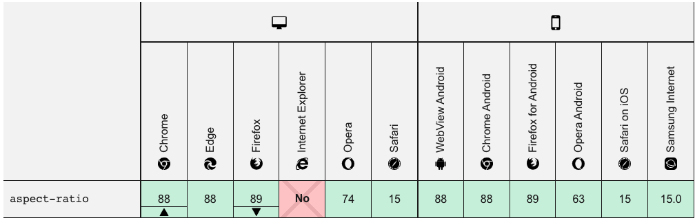

## 技巧提升

### 1. css实现多行文本展开效果

>css多行文本展开收起 = 控制按钮文字环绕效果 + 多行文本溢出省略 + 展开、收起状态切换


**难点**

+ 如何实现展开和收起切换按钮的文字环绕效果
+ 如何实现多行文本溢出省略效果
+ 如何实现展开和收起的状态or文字切换

#### 按钮文字环绕

> 局右：float: right;
>
> 局下：.text::before
>
> 浮动后高度塌陷（解决方法：在元素外边包一层具有包裹性又具有定位特性的标签）

```html
<div class="content">
  <div class="text">
    <label class="btn">展开</label>
    <span>
      但听得蹄声如雷，十余乘马疾风般卷上山来。马上乘客一色都是玄色薄毡大氅，
      里面玄色布衣，但见人似虎，马如龙，人既矫捷，马亦雄骏，每一匹马都是高头
      长腿，通体黑毛，奔到近处，群雄眼前一亮，金光闪闪，却见每匹马的蹄铁竟然
      是黄金打就。来者一共是一十九骑，人数虽不甚多，气势之壮，却似有如千军万
      马一般，前面一十八骑奔到近处，拉马向两旁一分，最后一骑从中驰出</span>
  </div>
</div>
<style>
  .content {
    display: flex;
  }
  .text {
    width: 475px;
    border: aqua solid 1px;
    color: #333;
    font-size: 14px;
  }
  .text::before {
    content: '';
    float: right;
    height: 100%;
    margin-bottom: -20px;
  }
  .btn {
    color: dodgerblue;
    cursor: pointer;
    /* 控制环绕 */
    float: right;
    clear: both;
    margin-right: 8px;
  }
</style>
```

#### 多行文本溢出省略

>`-webkit-line-clamp: 3`   （用来限制在一个块元素显示的文本的行数, 2 表示最多显示 2 行。为了实现该效果，它需要组合其他的WebKit属性）
>
>`display: -webkit-box`    (和 1 结合使用，将对象作为弹性伸缩盒子模型显示)
>
>`-webkit-box-orient: vertical`    (和 1 结合使用 ，设置或检索伸缩盒对象的子元素的排列方式)
>
>`overflow: hidden`     (文本溢出限定的宽度就隐藏内容)
>
>`text-overflow: ellipsis`    (多行文本的情况下，用省略号“…”隐藏溢出范围的文本)

```css
.text {
  display: -webkit-box;
  overflow: hidden;
  -webkit-line-clamp: 3;
  -webkit-box-orient: vertical;
}
```

#### 如何实现展开和收起状态切换

> 使用`input type=checkbox`控制展开与收起效果

```html
<input type="checkbox" id="exp" />
<style>
  #exp {
    visibility: hidden;
  }
  #exp:checked+.text {
    -webkit-line-clamp: 999; /*设置一个足够大的行数就可以了*/
  }
  .btn::after {
    content: '展开';
  }
  #exp:checked+.text .btn::after {
    content: '收起';
  }
</style>
```

#### 最终效果

```html
 <style>
      .content {
        display: flex;
      }
      .text {
        width: 475px;
        border: aqua solid 1px;
        color: #333;
        font-size: 14px;
        display: -webkit-box;
        overflow: hidden;
        -webkit-line-clamp: 3;
        -webkit-box-orient: vertical;
      }
      .text::before {
        content: "";
        float: right;
        height: 100%;
        margin-bottom: -20px;
      }
      .btn {
        color: dodgerblue;
        cursor: pointer;
        /* 控制环绕*/
        float: right;
        clear: both;
        margin-right: 8px;
      }
      #exp {
        visibility: hidden;
      }
      #exp:checked + .text {
        -webkit-line-clamp: 999; /*设置一个足够大的行数就可以了*/
      }
      .btn::after {
        content: "展开";
      }
      #exp:checked + .text .btn::after {
        content: "收起";
      }
    </style>
  </head>
  <body>
    <div class="content">
      <input type="checkbox" id="exp" />
      <div class="text">
        <label class="btn" for="exp"></label>
        <span>
          但听得蹄声如雷，十余乘马疾风般卷上山来。马上乘客一色都是玄色薄毡大氅，
          里面玄色布衣，但见人似虎，马如龙，人既矫捷，马亦雄骏，每一匹马都是高头
          长腿，通体黑毛，奔到近处，群雄眼前一亮，金光闪闪，却见每匹马的蹄铁竟然
          是黄金打就。来者一共是一十九骑，人数虽不甚多，气势之壮，却似有如千军万
          马一般，前面一十八骑奔到近处，拉马向两旁一分，最后一骑从中驰出</span
        >
      </div>
    </div>
  </body>
```

### 2. css绘制三角形

> 实心三角形 + 带边缘色三角形 + 圆角三角形

#### 实心三角形

> 正方形 + 加大border值 + 设置宽高为0 + 保留唯一颜色

```html
<div class="filled-triangle"></div>
<style>
  .filled-triangle {
    width: 0;
    height: 0;
    border: 50px solid transparent;
    border-bottom: 50px solid cyan;
  }
</style>
```

#### 气泡聊天框

> 圆角矩形 + 加尖脚三角形

```html
<div class="margin-triangle">hi, sister</div>
<style>
  .margin-triangle {
    position: relative;
    width: 300px; 
    height: 60px; 
    padding: 10px;
    border: 1px solid cyan; 
    border-radius: 8px;
  }
  /* 深色三角形 */
  .margin-triangle::before {
    position: absolute;
    top: 34px; 
    left: -10px; 
    border-top: 6px solid transparent; 
    border-bottom: 6px solid transparent; 
    border-right: 10px solid cyan;
    content: '';  
  }
  /* 画一个白色的三角形盖上去，错位 2 个像素 */
  .margin-triangle::after{
    position: absolute; 
    top: 34px; 
    left: -8px; 
    border-top: 6px solid transparent; 
    border-bottom: 6px solid transparent; 
    border-right: 10px solid #fff;
    content: '';  
  }
</style>
```

#### 圆角三角形

> 正方形 => 菱形 => 设置菱形一个角为圆角 => 拼接3个带圆角的菱形

```html
<div class="rounded-triangle"></div>
<style>
  /* 绘制正方形 */
  .rounded-triangle {
    width:  50px;
    height: 50px;
    background-color: cyan;
    /* 绘制菱形 */
    transform: rotate(-60deg) skewX(-30deg) scale(1, 0.866);
  }
  .rounded-triangle:before,
  .rounded-triangle:after {
    content: '';
    position: absolute;
    background-color: inherit;
    width:  50px;
    height: 50px;
    border-top-right-radius: 30%;
  }
  .rounded-triangle:before {
    transform: rotate(-135deg) skewX(-45deg) scale(1.414, .707) translate(0,-50%);
  }
  .rounded-triangle:after {
    transform: rotate(135deg) skewY(-45deg) scale(.707, 1.414) translate(50%);
  }
</style>
```

### 3. css3 loading加载动画

+ http://codepen.io/mr_alien/pen/FDLjg/
+ http://codepen.io/MarcMalignan/pen/svLux/
+ http://codepen.io/majci23/pen/NqdXvy/
+ https://codepen.io/jh3y/pen/VwLdVoZ
+ https://codepen.io/akhil_001/pen/gQwJPJ
+ https://codepen.io/team/keyframers/pen/YzKjoev
+ https://codepen.io/aaroniker/pen/XWWPbep
+ http://codepen.io/rss/pen/lKBaJ/
+ http://codepen.io/jonathansilva/pen/GhkAI/
+ http://codepen.io/TheDutchCoder/pen/mgswv/
+ http://codepen.io/tomchewitt/pen/yNdQrO/

### 4. 骨架屏实现

> 使用css实现，通过添加或移除loading类名控制是否显示骨架屏

**html部分**

```html
<div class="card">
  <div class="image">
    
  </div>
  <div class="content">
    <h4>CodingStartup</h4>
    <div class="description">
      Lorem ipsum dolor, sit amet consectetur adipisicing elit. Ex quasi enim facere commodi omnis...
    </div>
  </div>
</div>

<div class="card loading">
  <div class="image">
    
  </div>
  <div class="content">
    <h4></h4>
    <div class="description">
      
    </div>
  </div>
</div>
```

**css部分**

```css
:root {
  --loading-grey: #ededed;
}

body {
  background-color: #f6f6f6;
  font-family: Helvetica;
  font-size: 15px;
  display: flex;
  justify-content: space-evenly;
  align-items: center;
  min-height: 100vh;
}

.card {
  width: 320px;
  background-color: #fff;
  border-radius: 6px;
  overflow: hidden;
  box-shadow: 0px 4px 6px rgba(0, 0, 0, .12);
}

.image {
  height: 200px;
}

.image img {
  display: block;
  width: 100%;
  height: inherit;
  object-fit: cover;
}

.content {
  padding: 2rem 1.8rem;
}

h4 {
  margin: 0 0 1rem;
  font-size: 1.5rem;
  line-height: 1.5rem;
}

.description {
  font-size: 1rem;
  line-height: 1.4rem;
}

.loading .image,
.loading h4,
.loading .description {
  background-color: var(--loading-grey);
  background: linear-gradient(
    100deg,
    rgba(255, 255, 255, 0) 40%,
    rgba(255, 255, 255, .5) 50%,
    rgba(255, 255, 255, 0) 60%
  ) var(--loading-grey);
  background-size: 200% 100%;
  background-position-x: 180%;
  animation: 1s loading ease-in-out infinite;
}

@keyframes loading {
  to {
    background-position-x: -20%;
  }
}

.loading h4 {
  min-height: 1.6rem;
  border-radius: 4px;
  animation-delay: .05s;
}

.loading .description {
  min-height: 4rem;
  border-radius: 4px;
  animation-delay: .06s;
}
```

### 5. new Map()的使用

> 在开发过程中，涉及到数据结构，能使用Map不适应Array，尤其是复杂的数据结构。
>
> 如果对于数组的存储考虑唯一性，使用Set。

**Map和Array的对比**

```js
let map = new Map()
let arr = new Array()
// 增
map.set('a', 1)
arr.push({'a': 1})
// 查
map.has('a')
arr.find(item => item.a)
// 改
map.set('a', 2);
arr.forEach(item=> item.a?item.a=2:'')
// 删
map.delete('a')
arr.splice(arr.findIndex(item=>item.a),1)
```

**set map object 对比**

```js
let item = {a: 1};
let set = new Set()
let map = new Map()
let obj = new Object()
// 增
set.add(item)
map.set('a', 1)
obj['a'] = 1;
// 查
set.has(item)
map.has('a')
'a' in obj
// 改
item.a = 2;
map.set('a', 2)
obj['a'] = 2;
// 删
set.delete(item)
map.delete('a')
delete obj['a']

```

### 6. css实现自适应正方形

> padding-top使用%比数值时，是相对于父容器进行百分比计算数值的
>
> aspect-ratio:
>
>  CSS 属性为box容器规定了一个**期待的纵横比**，这个纵横比可以用来计算自动尺寸以及为其他布局函数服务

```html
<style>
  .box {
    width: 50%;
    background: blue;
    padding-top: 50%;
    /* 或者使用
    若为16/9 则为 width / height =  16/ 9
    aspect-ratio: 1/1;
    */
  }
</style>
<body>
  <div class="box"></div>
</body>
```

**兼容性**



