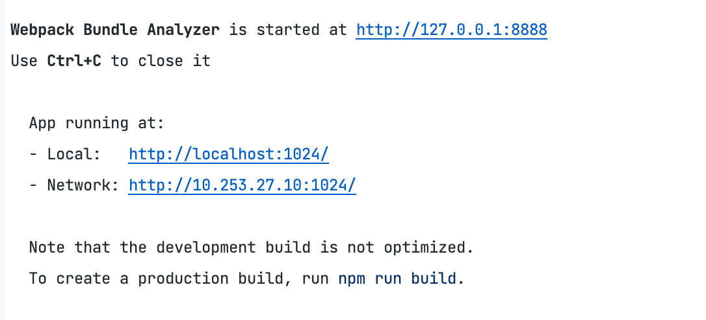
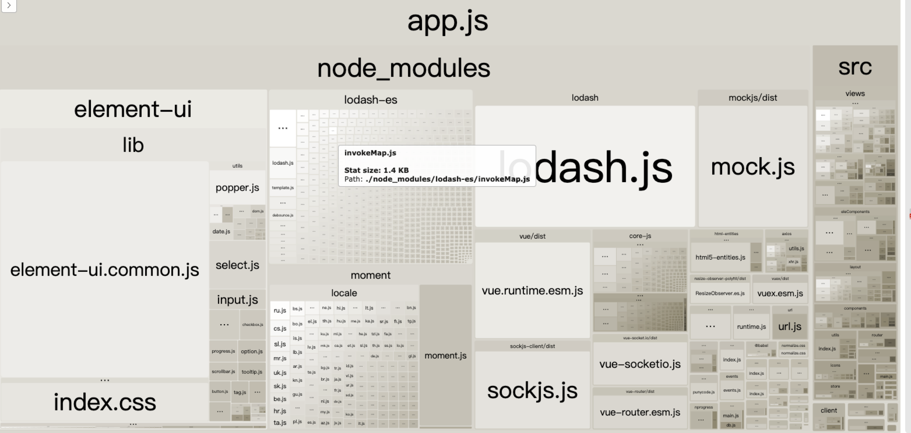
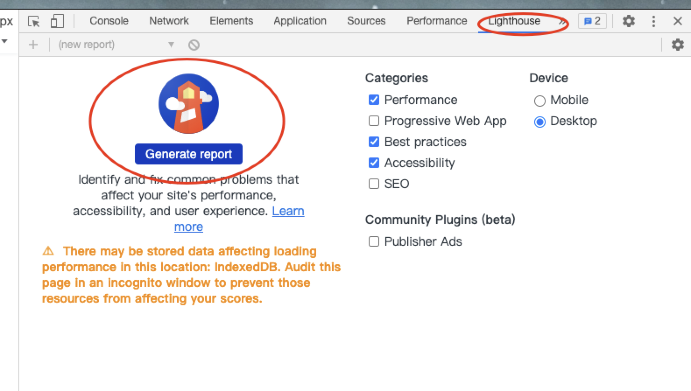
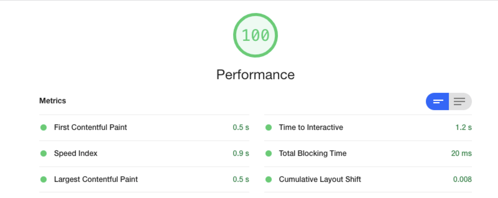

# 技术分享 - 仿vue-element-admin

> [vue-element-admin](https://github.com/PanJiaChen/vue-element-admin)
>
> [element-ui源码](https://github.com/ElemeFE/element)
>
> [vue-admin项目](https://github.com/btWin9527/vue-admin)

## 1. 目录结构

```text
├── build                     # 项目配置
│   ├── index.js              # 项目打包配置
├── package.json              # 项目依赖管理
├── mock                      # mock配置
|   ├── article.js            # 文章相关mock接口
|   ├── index.js              # 配置mock服务
|   └── mock-server.js        # 配置mock-server
└── src                       # 项目源代码  
|   ├── api                   # 项目所有请求
|   ├── assets                # 项目的静态资源eg：图片
|   ├── components            # 项目的公共组件
|   ├── constant              # 常量枚举
|   ├── directive             # 全局指令
|   ├── eleComponents         # elementUI组件模仿封装
|   ├── filters               # 全局filter
|   ├── icons                 # 项目用到的图标
|   ├── layout                # 组件头部，标签、侧边栏
|   ├── mixins                # mixins注入
|   ├── router                # 路由配置文件
|   ├── store                 # 全局store管理文件
|   ├── styles                # 样式文件
|   ├── utils                 # 全局公共方法
|   ├── views                 # 项目的所有组件方法
|   ├── App.vue               # 项目的入口文件
|   ├── main.js               # 入口文件，加载组件，初始化组件
|   ├── permission.js         # 权限组件
|   ├── settings.js           # 配置页面的title的页面
├── .env.xxx                  # 环境变量配置 
├── .eslintignore             # 严格模式下忽略的文件
├── .eslintrc.js              # eslint配置 
├── .gitignore                # git提交是忽略的文件 
├── babel.config.js           # babel配置 
├── package.json              # package.json  
├── postcss.config.js         # postcss配置 
├── vue.config.js             # vue-cli配置 
```

## 2. 常见项目配置

### webpack-bundle-analyzer

> 项目资源分析工具

1. 下载依赖包

   ```shell
   npm install --save-dev webpack-bundle-analyzer
   ```

2. vue.config.js配置

   ```js
   // 使用webpack链式配置方法
   chainWebpack(config) {
      // 配置webpack-analyzer
       config
         .plugin('webpack-bundle-analyzer')
         .use(require('webpack-bundle-analyzer').BundleAnalyzerPlugin)
   }
   ```

3. 项目启动时，会同时启动一个资源分析的服务

   

4. 分析资源大小，优化项目

   


### lighthouse

> chrome自带插件，显示页面渲染参数指标





+ **First Contentful Paint** [首次绘制内容]    浏览器绘制的第一帧文本、图片等内容的时间

+ Speed Index [首屏展现平均值]		显示页面的可见部分的平均时间。它以毫秒为单位表示，会受视图端口大小的影响
+ **Largest Contentful Paint**  [最大内容绘制]  
+ **Time to Interactive**  [可交互时间]  测量页面所有资源加载成功并能够可靠地快速响应用户输入的时间。
+ Total Blocking Time [总阻塞时间]   衡量从FCP到TTI之间主线程被阻塞时长的总和。
+ Cumulative Layout Shift [累计布局偏移]  用来计算非预期的 UI 界面变更对用户操作的影响

[性能指标参考资源](https://juejin.cn/post/6844904200044806157#heading-21)

### cdn资源引入

> 将vue, vue-router, vuex等资源使用cdn链接引入，减小打包后app.js过大

```js
// 1. 注释或删除所有vue引入的地方
// import Vue from 'vue'
// 2. 删除package.json中vue资源
// 3. vue.config.js配置externals
configureWebpack: {
  externals: {
      vue: "Vue", // key为插件名称, value为vue实例名称 Vue
    },
}
// 4. 在html中引入vue资源
// <script src="https://cdn.bootcss.com/vue/2.6.10/vue.min.js"></script>
```


### vuex配置优化

> vuex 中使用modules模块划分的模式，可以使用以下方式优化

```js
// store/index.js
import Vue from 'vue'
import Vuex from 'vuex'
import getters from './getters'
Vue.use(Vuex)
/*
* require.context()函数创建自己的上下文，允许传递要搜索的目录，指示是否也应搜索子目录的标志以及用于匹配文件的正则表达式
require.context()在构建时，webpack 在代码中进行解析
* */
/* require.context
    实际上是 webpack 的方法,vue 工程一般基于 webpack,所以可以使用
    require.context(directory,useSubdirectories,regExp)
    接收三个参数:
    directory：说明需要检索的目录
    useSubdirectories：是否检索子目录
    regExp: 匹配文件的正则表达式,一般是文件名
*
* */
const modulesFiles = require.context('./modules', true, /\.js$/)

// 自动引入vuex模块
const modules = modulesFiles.keys().reduce((modules, modulePath) => {
  const moduleName = modulePath.replace(/^\.\/(.*)\.\w+$/, '$1')
  const value = modulesFiles(modulePath)
  modules[moduleName] = value.default
  return modules
}, {})

const store = new Vuex.Store({
  modules,
  getters,
})

export default store
```


## 3. mock数据

> 由于该项目属于纯前端技术，故使用本地启动`mock-server`来模拟数据

1. 下载mockjs搭建mock-server本地服务

   ```shell
   npm install --save-dev mockjs
   # mock-server过程省略，类似node搭建express本地服务（有兴趣可以参考mock/mock-server.js和mock/index.js）
   ```

2. 配置mock数据

   ```js
   // 参考mock/article.js
   // 例子
   // 1. 编写接口
   export default [
     // 数据修改接口
     {
       url: '/article/update',
       type: 'post',
       response: _ => ({
         code: 20000,
         data: 'success'
       })
     }
   ]
   // 2. 在mock/index.js引入article模块
   const mocks = [
     ...user,
     ...article
   ]
   ```

3. 配置代理服务

   ```js
   // vue.config.js
   // mock地址为 http://127.0.0.1:${port}/mock ,端口号为当前项目端口
   // 将xxx/开头的代理到mock服务上
   devServer: {
     proxy: {
      [process.env.VUE_APP_BASE_API]: {
           target: `http://127.0.0.1:${port}/mock`,
           changeOrigin: true,
           pathRewrite: {
             ['^' + process.env.VUE_APP_BASE_API]: ''
           }
      },  
   },
    after: require('./mock/mock-server.js') // 配置中间件mock服务
   }
   
   ```

4. 使用xxx/开头的url请求接口就可以了

```js
// api请求封装
// 获取文章信息接口
export function getArticle(data) {
  return request({
    url: '/article/list',
    method: 'get',
    params:data
  })
}

// 调用接口
// 使用$promise统一封装.then().catch()方法,返回[data, err]
async getArticle(pageNum, pageSize) {
  /*
        * try {}catch(error){}
        * 处理接口返回异常时的处理及错误定位
        * 补充：在request.js配置中，只有状态码为20000时，会返回响应体,非20000时会自动进入catch中处理错误
        * */
  /*
  try {
    const {data} = await getArticle({
      page: pageNum,
      limit: pageSize,
    });
    if (data) {
      this.articleList = data.items;
      this.totalSize = data.total;
    }
  } catch (error) {
    console.log(error, 'error');
   }
   */

  /*
     * 通过async/await处理接口返回异常
   * */
  const [listData, listErr] = await this.$promise(getArticle({
    page: pageNum,
    limit: pageSize,
  }));
  console.log(listData, 'listData')
  if (listData && listData.code == 20000) {
    let {data} = listData;
    this.articleList = data.items;
    this.totalSize = data.total;
  }
  if (listErr) throw new Error('Could not find article list');// 处理请求异常
},
```


## 4. 权限配置

> 权限主要是通过路由筛选来实现的，达到不同管理员展示不同的页面

```js
{
      path: 'page',
      component: () => import('@/views/permission/perPage'),
      name: 'perPage',
      meta: {
        title: 'Page',
        roles: ['admin']
      },
    },
    {
      path: 'directive',
      component: () => import('@/views/permission/perDirective'),
      name: 'perDirective',
      meta: {
        title: 'Directive',
        roles: ['admin','editor']
      },
},
```

### 4.1 页面权限

> 路由中区分普通路由和权限路由两部分，通过router.addRoutes(routes)拼接权限路由

1. router/index.js配置非权限路由
2. 使用vueRouter导航守卫实现路由拼接

**前端控制路由缺点**

+ 无法实现角色页面权限分配，应当每个页面的权限是可配置的

### 4.2 指令权限

> 通过自定义指令`v-permission`，实现内容区或按钮的显示与隐藏

**指令封装**

```js
// permission.js
/**
 * inserted  被绑定元素插入父节点时调用
 * binding  指令配置对象
 * binding.value  指令的绑定值
 */
export default {
  inserted(el, binding, vnode) {
    const { value } = binding
    const roles = store.getters && store.getters.roles
		// admin editor
    if (value && value instanceof Array && value.length > 0) {
      const permissionRoles = value

      const hasPermission = roles.some(role => {
        return permissionRoles.includes(role)
      })

      if (!hasPermission) { // 无权限删除当前元素
        el.parentNode && el.parentNode.removeChild(el)
      }
    } else {
      throw new Error(`need roles! Like v-permission="['admin','editor']"`)
    }
  }
}
```

**指令调用**

```vue
<template>
 <!-- admin权限显示 -->
  <div>
    <span v-permission="['admin']" class="permission-alert">
      <el-tag class="permission-tag" size="small">admin权限</el-tag>
    </span>
    <el-tag v-permission="['admin']" class="permission-sourceCode" type="info">
      v-permission="['admin']"
    </el-tag>
    </div>
  <!-- editor权限显示 -->
  <div>
    <span v-permission="['editor']" class="permission-alert">
      <el-tag class="permission-tag" size="small">editor权限</el-tag>
    </span>
    <el-tag v-permission="['editor']" class="permission-sourceCode" type="info">
      v-permission="['editor']"
    </el-tag>
    </div>
  <!-- 任何权限都显示 -->
  <div>
    <span v-permission="['admin','editor']" class="permission-alert">
      Both
      <el-tag class="permission-tag" size="small">admin</el-tag> and
      <el-tag class="permission-tag" size="small">editor</el-tag> can see this
    </span>
    <el-tag v-permission="['admin','editor']" class="permission-sourceCode" type="info">
      v-permission="['admin','editor']"
    </el-tag>
    </div>
</template>
```

## 5. el-button组件封装

> 分析element-ui组件封装方法，研究最基础的ui组件，el-button
>
> [vue2 el-button](https://github.com/ElemeFE/element)
>
> [vue3 el-button](https://github.com/element-plus/element-plus)

  [**探究element-ui源码**](https://github.com/ElemeFE/element)

```text
// template + script = xxx.vue
1. component = (template + script) + css
2. xxx.vue代码位置  --  element/packages/button/src/button.vue
3. css代码位置  --  element/packages/theme-chalk/src/button.scss
```

**学习点**

1. scss语法

+ scss基础用法

  ```scss
  /* scss基础语法 */
  .content {
    background: red;
    .nav {
      background: blue;
    }
  }
  ```

  ```less
  /* less基础语法 */
  .content {
    background: red;
    .nav {
      background: blue;
    }
  }
  ```

+ 变量定义

  ```scss
  /*
  scss变量定义
  字符串需要添加引号,也可以不加
  */
  // 命名空间 -- ui库class命名前缀
  $namespace: 'zyb';
  ```

  

  ```less
  /*
  less变量定义
  字符串不需要添加引号
  */
  // 命名空间 -- ui库class命名前缀
  @zyb-prefix: zyb;
  ```

  

+ @mixin和@include

  ```scss
  // scss版本
  // mixin.scss
  @mixin b($block) {
    // !global效果类似!important,强制修改
    $B: $namespace+'-'+$block !global;
    // #{}插值语句,类似vue的{{}}
    .#{$B} {
      @content;
    }
  }
  // button.scss
  @include b(button) {
    display: inline-block;
    line-height: 1;
    white-space: nowrap;
  }
  ```

  ```less
  // less 版本
  // mixin.less
  .btn() {
    position: relative;
    display: inline-block;
    font-weight: @btn-font-weight;
  }
  
  // button.less
  @btn-prefix-cls: ~'@{zyb-prefix}-btn';
  .@{btn-prefix-cls} {
    .btn();
  }
  ```

+ @at-root

```scss
.button {
  background: red;
  @at-root {
    .is-loading {
      color: blue;
    }
  }
}
```


