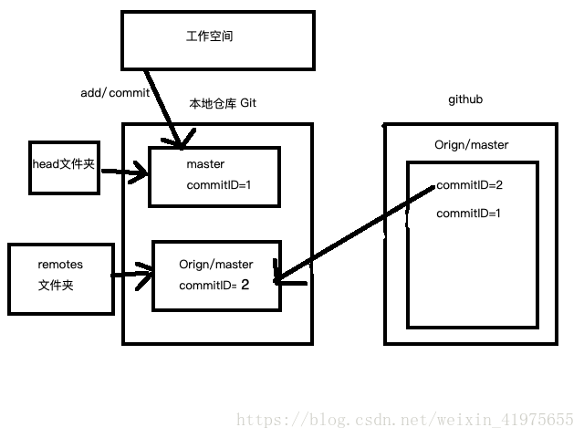
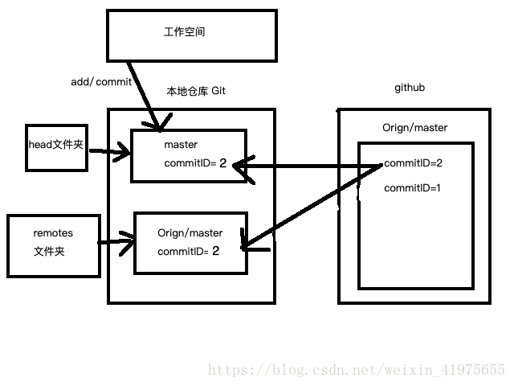

# git常用操作

> 推荐学习网址
> https://learngitbranching.js.org/?locale=zh_CN

## 1. 获取与创建项目

### A1.1 git初始化本地仓库

> git init

```shell
# 将一个目录初始化为git仓库
git init

# 配置全局信息
git config --global user.name "zhangsan"
git config --global user.email 123.@qq.com
# 查看配置信息
git config --list
# 查看全局配置用户名
git config --global user.name
# 查看全局配置用户邮箱
git config --global user.email
```

### 1.2 复制一个git仓库

> git clone [url]

```shelll
# [url]为想要复制的项目
git clone [url]
```

## 2. 基本的快照

### 2.1 添加文件到缓存区

> git add

```shell
# 本地修改需要先添加到到缓存 （即追踪文件的变化）
# 查看当前git状态
git status -s
 ?? a.txt
 # ?? a.txt 表示a.txt未被追踪到
 # 将a.txt添加到暂存区
 git add a.txt
 # 再次查看当前状态
 git status -s
 # A a.txt 表示a.txt已经被追踪添加成功
 A a.txt
 # 修改a.txt文件，再次查看状态
 git status -s
 AM a.txt
 # AM 表示这个文件在我们将它添加到缓存之后又有改动
```

**git add快速操作**

```shell
# 将当前文件目录下的所有文件添加追踪 (不包括被删除的文件)
git add .
# 通过递归操作，将当前文件的索引子集目录添加到git仓库
git add *
# 监控索引文件
git add -A
```

### 2.2 查看文件缓存状态

> git status

```shell
# 加 -s参数可以获取简短的输出
git status -s
```

### 2.3 显示改动差异

> git diff  [描述已临时提交的或者已修改但尚未提交的改动]
>
> 如果没有其他参数，`git diff`会以规范的diff格式显示自从上次提交快照之后尚未缓存的所有修改

```sh
# 修改文件之后，执行git diff
warning: LF will be replaced by CRLF in a.txt.
The file will have its original line endings in your working directory
diff --git a/a.txt b/a.txt
index 40f4dc6..f678797 100644
--- a/a.txt
+++ b/a.txt
@@ -1,2 +1,2 @@
 fdafds
-
+ttest
```

**git diff 快速操作**

```sh
# 显示已缓存的文件的改动
git diff --cached
# 缓存文件修改记录
diff --git a/a.txt b/a.txt
new file mode 100644
index 0000000..40f4dc6
--- /dev/null
+++ b/a.txt
@@ -0,0 +1,2 @@
+fdafds
+

# 显示已缓存的与未缓存的所有改动
git diff HEAD

# 显示摘要而非整个diff
git diff --stat
The file will have its original line endings in your working directory
 a.txt | 2 +-
 1 file changed, 1 insertion(+), 1 deletion(-)
```

### 2.4 记录缓存内容的快照

> git commit
>
> 将缓存的内容存储起来

```sh
# 配置git 用户信息
git config --global user.name 'guo xiao ye'
git config --global user.email '123@qq.com'
# 使用 -m 提供提交的注释
git commit -m '提交信息记录'
[master (root-commit) 9a3f411] first test
 1 file changed, 2 insertions(+)
 create mode 100644 a.txt
 # 再次查看git 记录
 git status
 On branch master
nothing to commit, working tree clean
```

**git commit 快速操作**

```sh
# 自动将在提交前将已记录、修改的文件放到缓冲区(如果新增的文件需要手动git add操作)
git commit -a -m 'message'
```

### 2.5 取消缓存已缓存的内容

> git reset HEAD
>
> 简介：执行 `git reset HEAD` 以取消之前 `git add` 添加，但不希望包含在下一提交快照中的缓存

```sh
git status -s
# 未添加到暂存区 (此时M为红色)
M a.txt
git add .
git status -s
# 已经添加到暂存区（此时M为绿色）
M a.txt
# 取消暂存
git reset HEAD a.txt
git status -s
# 未添加到暂存区
M a.txt
```

### 2.6 将文件从缓冲区移除

> git rm
>
> 简介：将条目从缓冲区移除，将文件从缓存区和你的硬盘中（工作目录）删除
>
> 要在工作目录中留着该文件，可以使用 `git rm --cached`

## 3. 分支与合并

### 3.1 创建及切换分支

> git branch [branchName]

```sh
# 在当前分支上创建分支
git branch dev
# 列出本地分支
git branch
dev
* master
# *master表示当前位于master分支

# 切换分支
git checkout dev

# 创建并切换分支
git checkout -b dev

# 删除分支
git branch -d div

# 查看远程分支
git branch -r

# 查看所有分支
git branch -a

```

### 3.2 分支合并

> git merge
>
> 简介：将分支合并到你的当前分支

```sh
# 将dev分支合并到当前分支
git merge dev

# 如果遇到冲突，列出冲突文件(0的标识该文件没有冲突，1表示两个用户之前一个共同版本的对应内容；2表示当前用户对应的文件版本；3表示合并后的文件对应的远程版本)
git ls-files -s
# 查看对应文件的对应版本内容
git show :1:a.txt
# 解决完冲突后，需要手动add commit push 就可以了

```

### 3.4 查看分支更改记录

> git log
>
> 简介：显示修改日志

**日志快速操作**

```sh
# 显示简洁日志
git log --oneline

# 显示分支相关操作的日志
git log --oneline --graph
```

### 3.5 给历史记录打标签

> git tag 
>
> 在历史更新版本节点添加标签记录

```sh
# 添加一条包含注释的tag日志
git tag -a 'tagname' -m 'tag记录信息'
```

## 4. 分享与更新项目

### 4.1 关联远端仓库

> git remote
>
> 简介：列出远端仓库名称

```sh
# 列出远端仓库信息
git remote -v
# 为项目添加新的远程仓库 (将url以alias的别名添加到本地的远端仓库)
git remote add [alias] [url]
# 删除远端分支 (删除远端alias别名的分支)
git remote rm [alias]
```

### 4.1 拉去代码

> git fetch
>
> 介绍：同步远端仓库，提取本地所没有的数据
>
> git pull
>
> 介绍：= git fetch + merge , 拉去远端代码后merge到当前所在分支

```sh
# git fetch [alias] 来将你的仓库与远端仓库同步，提取所有它独有的数据到本地分支以合并或者怎样。
```

 **对比git fetch和git pull**

+ git fetch

> 使用git fetch更新代码，本地的库中master的commitID不变，还是等于1。但是与git上面关联的那个orign/master的commit ID变成了2，若有冲突发生，则解决完冲突就会生成一个新的代码版本 ID = 3

【相当于fetch的时候本地的master没有变化，但是与远程仓关联的那个版本号被更新了，我们接下来就是在本地合并这两个版本号的代码】



+ git pull

> **将本地的代码更新至远程仓库里面最新的代码版本**



### 4.3 推送代码到远端仓库

> git push [alias] [branch]
>
> 介绍：git push 将你的[branch]分支推送成为[alias]远端上的[branch]分支

```sh
# 将github分支推送到远程master分支上
git push github master
```

**快捷操作**

```sh
# 1. -u 使用 -u 参数指定一个默认主机
git push -u origin master
# 2. 不管是否存在对应的远程分支，将本地的所有分支都推送到远程主机，这时需要 -all 选项
git push --all origin
# 3. 强制推送版本修改
git push --force origin
```

## 5. 撤回提交记录

### 5.1 本地修改未commit

```sh
# 本地修改a文件，未commit到本地仓库，撤回操作 git checkout <fileName>
git checkout a.txt

```

### 5.2 本地修改已经commit

```sh
# 本地修改a文件，已经commit到本地仓库，撤回操作 git reset --hard HEAD~1
git reset --hard HEAD~1
# 此时代码保留，回到 git add 之前
git reset HEAD^  
```

### 5.3 本地修改已经上传到远端仓库

```sh
# 本地修改,已经更新到远端仓库 (先切换到远端分支)  git revert HEAD
git revert HEAD
```

## 6. git缩写命令

| 简写 | 命令                                 |
| ---- | ------------------------------------ |
| g    | git                                  |
| gst  | git status                           |
| gd   | git diff                             |
| gdc  | git diff --cached                    |
| gl   | git pull                             |
| gup  | git pull --rebase                    |
| gp   | git push                             |
| gc   | git commit                           |
| gco  | git checkout                         |
| gb   | git branch                           |
| glo  | git log --oneline --decorate --color |
| gss  | ogit status -s                       |
| ga   | git add                              |
| gm   | git merge                            |
| gp   | git push                             |

## 7. 常用指令记录

### 7.1 git多次rebase

```sh
# 多次 git rebase <第一个分支> <第二个分支> (类似成语接龙，将第二个分支记录rebase到第一个分支记录上)
git rebase master bugFix
git rebase bugFix side
git rebase side another
```

### 7.2 git拉去代码

```sh
# 方式1： git fetch (更新本地的远程分支代码) + git merge （将本地远程的代码合并到当前本地代码分支） = git pull
git pull
# 方式2： git fetch (更新本地的远程分支代码) + git rebase （将本地远程的代码rebase到当前本地代码分支） = git pull --rebase
git pull --rebase
```

**解析**

```text
情景：本地分支test是在git远程master分支[B节点]新建开发的，产生了D,E两个节点的记录。同时，远程已经有其它同事更新代码到master远程分支，产生C,F两个节点记录。此时需要更新远程代码到本地:

1. 开发git树形图 
       D---E test
      /
 A---B---C---F--- master
 
2. git fetch + git merge方式更新代码(git pull)
        D--------E
      /          \
 A---B---C---F----G---   test, master

3. git fetch + git rebase方式更新代码(git pull --rebase)
A---B---D---E---C‘---F‘---   test, master

【特殊情况】-- 更新代码冲突
1. merge 操作遇到冲突的时候，当前merge不能继续进行下去。手动修改冲突内容后，add 修改，commit 就可以了。
2. rebase 操作的话，会中断rebase,同时会提示去解决冲突。解决冲突后,将修改add后执行git rebase –continue继续操作，或者git rebase –skip忽略冲突。
```

### 7.3 git切换分支

```sh
# 1. 切换分支并建立指定的远端关联分支
git checkout -b <本地分支名> <远程分支名>
# 2. 设置远程追踪分支
git branch -u <远程分支名> <本地分支名>
```

## 8. git提交规范

> **commit格式**

`<type>: <subject>` 注意冒号后面有空格


> **type**

用于说明commit的类别，只允许使用以下标识

+ feat  新功能(feature)
+ fix: 修补bug
+ docs: 文档(documentation)
+ style: 格式（不影响代码运行的变动）
+ refactor: 重构(即不是新增功能，也不是修改bug的代码变动)
+ test: 增加测试
+ chore: 构建过程或辅助工具的变动


> **subject**

subject是commit目的的简短描述，不超过50个字符，且结尾不加句号(.)


> **栗子🌰**

```sh
git commit -m 'feat:添加了一个用户列表页面'

git commit -m 'fix:修复用户列表页面无法显示的bug'

git commit -m 'refactor:用户列表页面代码重构'
```

