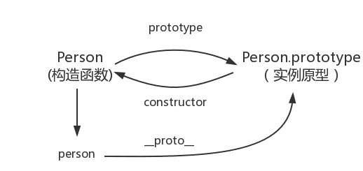

# JS 基础知识点

## 1. 数据类型部分

> 重点划分

+ 数据类型分类
+ 类型转换

+ 各种数据类型的判断方式 （多种）

+ this相关考点

### 1.1 数据类型分类

> 要点：基础数据类型(6种)，复杂数据类型(引用类型)Object

```text
基础数据类型：
boolean,null(typeof null === 'objcet',但为基础数据类型,js遗留bug),undefined,number,string,symbol
引用数据类型：
Objcet (包含Array,Function,Date)
```

### 1.2 数据类型转换

> 常用的有转换为bool,转换为number,转换为string
>
> 要点：哪些类型转成bool表示false (7种)；对象转类型时，会调用内置的`[[ToPrimitive]]`

**转成bool表示false**

```text
转bool为false的类型如下：
undefined, null, false, NaN, '', 0, -0
```

**对象转类型时，会调用内置的`[[ToPrimitive]]`**

```js
[]+[] = ''; // 执行操作 [].toString() = '';
[]+![]= 'false' ; // 执行操作 ![] = false; '' + false = 'false'
```

### 1.3 数据类型判断

> 要点：使用typeof判断所有数据类型; 使用Object.prototype.toString.call()判断所有类型 `简写 toString.call()`

```js
// typeof方法
typeof undefined === 'undefined' // true
typeof true === 'boolean' // true
typeof 42 === 'number' // true
typeof '42' === 'string' // true
let obj = {life: 42};
typeof obj === 'object' && obj && !obj.length // true
let arr = [1,2,3];
typeof arr === 'object' && arr && arr.length // true
typeof Symbol() === 'symbol' // true
let a = null;
(!a && typeof a) === 'object' // true
typeof function a(){} === 'function' // true

// toString.call()
// 改造toString.call()方法
const _toString = Object.prototype.toString;
function toRawType(value) {
    return _toString.call(value).slice(8, -1);
}
```

### 1.4 this相关考点

> this是谁？

+ 对于直接调用foo,不管foo函数在哪，this一定是`window`
+ 对于obj.foo()，谁调用了函数，谁就是this,则这里foo中this就是`obj对象`
+ 对于new的方式，this永远绑定在c上面，不会被任何方式改变this

```js
function foo() {
  console.log(this.a)
}
var a = 1
foo() // 1

const obj = {
  a: 2,
  foo: foo
}
obj.foo() // 2

const c = new foo()// undefined
```

【补充】

1. 使用bind修改this指向，若对一个函数多次bind,this永远由**第一次bind**决定
2. 箭头函数没有上下文this,使用bind无效，其this取决于上层的this

## 2. 闭包、深（浅）拷贝、原型链

> 重点划分

+ 闭包的概念(涉及概念：`函数调用完就会立即销毁`)
+ 深拷贝（递归、序列化、引用类型拷贝地址）
+ 原型链（实例，构造函数，原型）

### 2.1 闭包

> 要点：闭包是通过改变js回收机制保留某作用域的一种手段，即能够**读取其它函数内部变量**的函数 (或者说函数 A 内部有一个函数 B，函数 B 可以访问到函数 A 中的变量，那么函数 B 就是闭包)

+ 函数嵌套函数
+ 函数内部可以引用函数外包的参数和变量
+ 函数和变量不会被垃圾回收机制回收

```js
// 闭包常见使用场景 (解决的一个典型的问题就是循环绑定的问题)
// 案例：循环中使用闭包，解决循环中包含异步操作，i永远为最后一个
// 1.1 使用闭包缓存数据 
for(var i=0;i<=5;i++){
    ;(function(i){
      setTimeout(function(){
        console.log(i)
      },10)
    })(i)
}
// 1.2 使用let实现i缓存 (块级作用域)
for(let i=0;i<=5;i++){
    setTimeout(function(){
        console.log(i)
    },10)
}
// 1.3 使用setTimeout第三个参数，这个参数会被当成 timer 函数的参数传入
for(var i=0;i<=5;i++){
    setTimeout(function(i){
        console.log(i)
    },10,i)
}
```

### 2.2 深拷贝和浅拷贝

> 要点：除了JSON序列化操作实现**深拷贝**外，其余api实现的拷贝接为**浅拷贝**
>
> 易错点：Object.assign({},targetObj) 可解决对象赋值，修改对象b属性，影响a属性，但并非深拷贝


```js
// 赋值操作引起导致改变了一方其他也都被改变
let a = {
  age: 1
}
let b = a
a.age = 2
console.log(b.age) // 2
```

**解决方法1：Object.assign({},sourceObj)**

> 用法：将所有可枚举属性的值从一个或多个源对象分配到目标对象，并返回目标对象

```js
let a = {
  age: 1
}
let b = Object.assign({}, a)
a.age = 2
console.log(b.age) // 1
```

**解决方法2：{...a}**

> 用法：允许一个表达式在某处展开，特殊用法：伪数组=> 数组

```js
let a = {
  age: 1
}
let b = { ...a }
a.age = 2
console.log(b.age) // 1
```

**解决方法3：深拷贝（序列化）**

> JSON.parse(JSON.stringify(object))

```js
let a = {
  age: 1,
  jobs: {
    first: 'FE'
  }
}
let b = JSON.parse(JSON.stringify(a))
a.jobs.first = 'native'
console.log(b.jobs.first) // FE
```

【局限性】

+ 会忽略 `undefined`
+ 会忽略 `symbol`
+ 不能序列化函数
+ 不能解决循环引用的对象

**解决方法4：深拷贝（递归）**

> 递归注意：

+ 判断是否为对象 (`(typeof obj === 'object' || typeof obj ==='function')&&typeof obj !== null`)
+ 临时变量设置，需要判断是对象或数组`let tempObj=Array.isArray(obj)?[]:{}`
+ 对象遍历时，需要区分对象的属性值是否为引用类型：引用类型，进一步自调用递归;普通类型，直接赋值

```js
/* 是否为对象 */
function isObject(obj){
    return (typeof obj === 'object' || typeof obj === 'function') && obj !== null;
}

/* 深拷贝 */
function deepClone(obj) {
    if(!isObject(obj)) {
        throw new Error('对象')
    }
    let tempObj = Array.isArray(obj)? [] : {}; // 初始化数据格式
    for(let key in obj){
       if(obj.hasOwnProperty(key)){ // 判断是否存在属性
           if(obj[key] && isObject(obj)){ // 判断该属性值是否为引用类型
             tempObj[key] = deepClone(obj[key]);
           }else{
               tempObj[key] = obj[key];
           }
       }
    }
	return tempObj;
}
let obj = {
  a: [1, 2, 3],
  b: {
    c: 2,
    d: 3
  }
}
let newObj = deepClone(obj)
newObj.b.c = 1
console.log(obj.b.c) // 2

/* 优化深拷贝 */
function deepCloneOptimize(obj) {
  function isObject(o) {
    return (typeof o === 'object' || typeof o === 'function') && o !== null
  }

  if (!isObject(obj)) {
    throw new Error('非对象')
  }

  let isArray = Array.isArray(obj)
  let newObj = isArray ? [...obj] : { ...obj }
  // Object.keys()返回属性key，但不包括不可枚举的属性
  // Reflect.ownKeys()返回所有属性key
  Reflect.ownKeys(newObj).forEach(key => {
    newObj[key] = isObject(obj[key]) ? deepClone(obj[key]) : obj[key]
  })

  return newObj
}
```

### 2.3 原型链

> 要点：原型，实例，构造函数直接的关系



```js
// 构造函数 (绑定数据)
function Person(name) {
    this.name = name;
}
// 原型 (绑定方法)
Person.prototype.identify = function(){
    return "I\'m" + this.name;
}
var cat = new Person('cat'); // 实例
console.log(cat.__proto__ === Person.prototype); // true
console.log(Person === Person.prototype.constructor); // true
```

## 3. new 和instanceof实现

> 重点划分

+ new (调用new执行操作4步，实现new操作5步)
+ instanceof(通过构造函数进行判断)