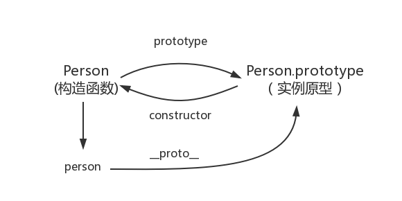

# 我的面试过程

## 1. 讲讲事件循环机制

> 执行一段代码，会先执行同步任务，执行过程中如果遇到微任务，则把它添加到微任务的任务队列中。


+ 微任务  (Promise)

+ 宏任务  (setTimeout)

+ 执行栈  (同步代码的执行，按照顺序添加到执行栈中)

+ 事件队列  (异步代码的执行)

  `异步代码的执行，遇到异步事件不会等待它返回结果，而是将该事件挂起,继续执行执行栈中的其它任务。当异步事件返回结果，就把它放到事件队列中，被放入事件队列不会立即执行起回调，而是等待当前执行栈中所有任务执行完毕，主线程空闲状态，主线程会去查找事件队列中是否还有任务。若有，则去除排在第一位的事件，并把这个事件对应的回调放到执行栈中，然后执行其中的同步代码`

```js
// 示例代码
console.log('start')

setTimeout(function() {
  console.log('setTimeout')
}, 0)

Promise.resolve().then(function() {
  console.log('promise1')
}).then(function() {
  console.log('promise2')
})

console.log('end')
```


**解析**

1. 全部代码压入执行栈执行,输出start
2. setTimeout压入macrotask队列，promise.then回调放入microtask队列,最后执行console.log('end')，输出end
3. 调用栈中的代码执行完成（全局代码属于宏任务），接下来开始执行微任务队列中的代码，执行promise回调，输出promise1,promise回调函数默认返回undefined,promise状态变成fullfilled,出发接下来的then回调，继续压入microtask队列，此时产生了新的微任务，会接着当前的微任务队列执行完，此时执行第二个promise.then回调，输出promise2
4. 此时，microtask队列已情况，接下来会执行UI渲染工作，然后开始下一轮event loop,执行setTimeout的回调，输出setTimeout

**答案**

- start
- end
- promise1
- promise2
- setTimeout

## 2. mvvm双向绑定原理

> Vue组件挂载时，会先对所有需要的属性调用Object.defineProperty(),然后实例化Watcher,传入组件更新的回调，在实例化的过程中，会对模板中的属性进行求值，触发依赖搜集

## 3. 项目中常用的webpack配置

```js
// 1. 别名设置alias (webpack.base.conf.js或vue.config.js)
 alias: {
      'vue$': 'vue/dist/vue.esm.js',
      '@': resolve('src'),
 }
// 2. 环境变量的配置
process.env.NODE_ENV 
// 3. devserver跨域配置
proxy:  {
      '/api/*': {
        target: 'http://localhost:8888/', // 目标服务器地址
        secure: false, // 目标服务器地址是否是安全协议
        changeOrigin: true, // 是否修改来源, 为true时会让目标服务器以为是webpack-dev-server发出的请求!
        // '/api/login' =>    target + '/login'
        pathRewrite: {'^/api': '/'} // 将/api开头的请求地址, /api 改为 /, 即 /api/xx 改为 /xx
      }
  }

```

## 4. 原型链



```js
function Person() {

}

var person = new Person();

console.log(person.__proto__ == Person.prototype) // true
console.log(Person.prototype.constructor == Person) // true
// 顺便学习一个ES5的方法,可以获得对象的原型
console.log(Object.getPrototypeOf(person) === Person.prototype) // true
```

## 5. 移动端适配原理

```js
/*
rem是相对长度单位，rem方案中的样式设计为相对于根元素font-size计算值的倍数。根据 屏幕宽度 设置html标签的font-size，在布局时使用 rem 单位布局，达到自适应的目的，是 弹性布局 的一种实现方式

实现过程：首先获取文档根元素和设备dpr，设置 rem，在html文档加载和解析完成后调整body字体大小； 在页面缩放 / 回退 / 前进的时候， 获取元素的内部宽度 (不包括垂直滚动条，边框和外边距)，重新调整 rem 大小

实现方法：用 css 处理器或 npm 包将页面 css 样式中的px自动转换成 rem。在整个 flexible 适配方案中，文本使用px作为单位，使用[data-dpr]属性来区分不同dpr下的文本字号。由于手机浏览器对字体显示最小是8px，因此对于小尺寸文字需要采用px为单位，防止通过 rem 转化后出现显示问题。手机淘宝 中的字体使用px为单位，腾讯新闻中的字体使用rem为单位

*/ 
var width = docEle.clientWidth;
docEle.style.fontSize = 100 * (width / 750) + 'px';
```

## 6. 大量数据列表加载卡顿

```js

```

## 7. hash路由和history路由的区别

```text
1. hash路由在地址栏URL上有#，而history路由没有会好看一点
2. 我们进行回车刷新操作，hash路由会加载到地址栏对应的页面，而history路由一般就404报错了（刷新是网络请求，没有后端准备时会报错）
3. hash路由支持低版本的浏览器，而history路由是HTML5新增的API
4. hash的特点在于它虽然出现在了URL中，但是不包括在http请求中，所以对于后端是没有一点影响的，所以改变hash不会重新加载页面，所以这也是单页面应用的必备
5. history运用了浏览器的历史记录栈，之前有back,forward,go方法，之后在HTML5中新增了pushState（）和replaceState（）方法（需要特定浏览器的支持），它们提供了对历史记录进行修改的功能，不过在进行修改时，虽然改变了当前的URL，但是浏览器不会马上向后端发送请求
```

## 8. 箭头函数使用扩展运算符获取arguments

```js
const testFun = (...args)=>{ // 使用展开运算符获取形参数组
  console.log(args,'args') // [1, 2, 3, 4, 5]
}
testFun(1,2,3,4,5);
```

## 9. webpack常用配置

```js

```

## 10. vue双向绑定原理及实现

https://www.cnblogs.com/canfoo/p/6891868.html

## 11. Vue history路由刷新404原因

```text
· hash模式的项目前进后台刷新都不会有问题，因为向服务器请求地址时是不带hash值的
· history模式的项目中url地址是通过h5的history API设置的，当浏览项目的二级页面的时候，浏览器并没有发送请求，但是浏览器会保存在历史纪录中，因此实现前进后退是没有任何问题的，但是它怕刷新。因为刷新是实实在在的向后端服务器发送这个url的请求的，but后台并不存这一个目录，所以返回404
```

## 12. 终端forEach操作

```js
try{
    [1,2,3,4,6].forEach((v, i) => {
        if(i === 2){
            throw new Error('跳出')
        }
        console.log(v)
    });
}catch(e){console.log(e)}
```

## 13. 并行执行

> 不等待其它请求结束，同时开始

```js
const list = [1,2,3];
const YB = async(v) => {
    return new Promise(resolve => {
        setTimeout(resolve, 1000, v**2)
    })
};

list.forEach(async (v) => {
    let res = await YB(v);
    console.log(res);
});
```

