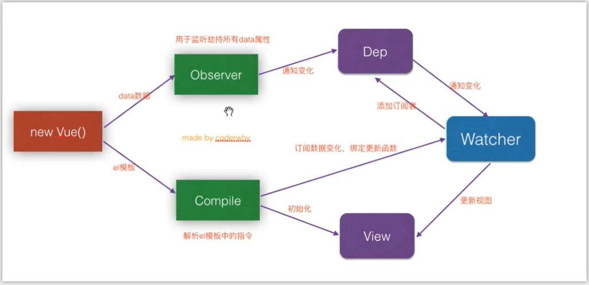

## 1. vue原理(数据劫持和监听)



## 2.vuex使用


## 3. 父子组件的生命周期

**加载渲染过程**

```text
父beforeCreate->父created->父beforeMount->子beforeCreate->子created->子beforeMount->子mounted->父mounted
```

**子组件更新过程**

```text
父beforeUpdate->子beforeUpdate->子updated->父updated
```

**父组件更新过程**

```text
父beforeUpdate->父updated
```

**销毁过程**

```text
父beforeDestroy->子beforeDestroy->子destroyed->父destroyed
```


## 4. v-if和v-for哪个优先级更高

> **v-for比v-if优先级高**，所以使用的话，每次v-for都会执行v-if,造成不必要的计算，影响性能，尤其是当之需要渲染很小一部分的时候

```vue
<ul>
    <li v-for="user in users" v-if="user.isActive" :key="user.id">
      {{ user.name }}
    </li>
</ul>
```

**computed解决v-if和v-for同时使用**

```vue
<div>
	<div v-for="(user,index) in activeUsers" :key="user.index" >
		{{ user.name }} 
	</div>
</div>
data () {  // 业务逻辑里面定义的数据
    return {
      users,: [{
        name: '111111',
        isShow: true
      }, {
        name: '22222',
        isShow: false
      }]
    }
  }
computed: {
	activeUsers: function () {
		return this.users.filter(function (user) {
			return user.isShow;//返回isShow=true的项，添加到activeUsers数组
		})
	}
}
```

## 5. 