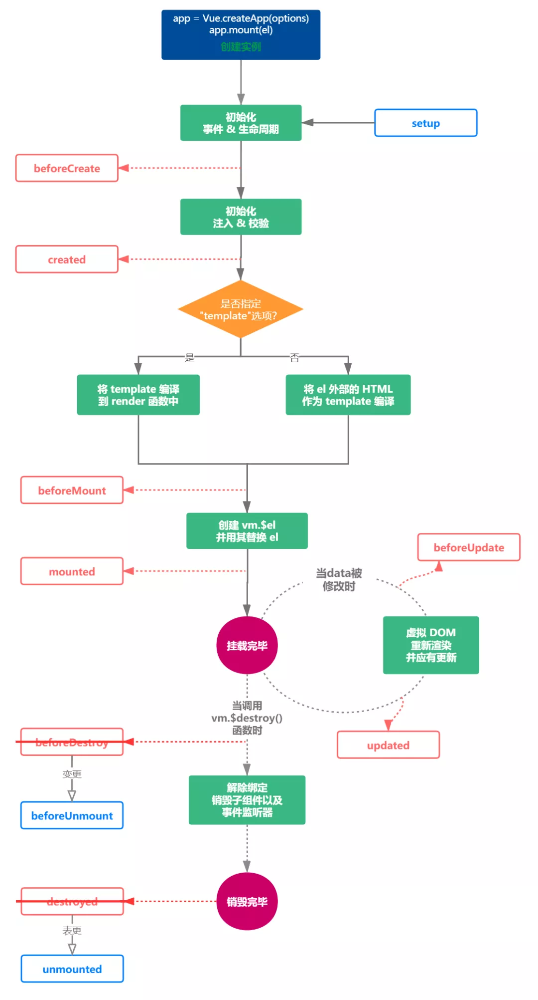

# vue2 和 vue3 比较

## 1. Composition API (vue3)

### 1. 1 setup

> setup 执行时机是在beforeCreate之前执行，由于在执行`setup` 时尚未创建组件实例，因此在 `setup` 选项中没有 `this`

```vue
<!--
setup接受参数：
	1. props: 组件传入的属性
	2. context
-->

<script>
// setup中接受的props是响应式的， 当传入新的props 时，会及时被更新。由于是响应式的， 所以不可以使用ES6解构，解构会消除它的响应式
// 错误代码
  export default defineComponent ({
    setup(props, context) {
        const { name } = props // 解构
        console.log(name)
    },
})
</script>

```

### 1.2 reactive、ref和toRefs

> reactive定义复杂的数据类型的数据
>
> ref推荐定义基本数据类型
>
> 使用toRef将某个对象中的属性变成响应式数据，修改响应式数据是会影响到原始数据的。但是需要注意，**如果修改通过toRef创建的响应式数据，并不会触发UI界面的更新**
>
> toRefs接收一个对象作为参数，它会遍历对象身上的所有属性，然后挨个调用toRef执行

```vue
<template>
	<div>
    <p>第 {{ year }} 年</p>
    <p>姓名： {{ nickname }}</p>
    <p>年龄： {{ age }}</p>
  </div>
</template>
<script>
  import {defineComponent, reactive, ref, toRefs} from 'vue';
  export default defineComponent({
    setup() {
      const year = ref(0);
      const user = reactive({ nickname: "xiaofan", age: 26, gender: "女" });
      setInterval(() =>{
        year.value ++
        user.age ++
      }, 1000)
      return {
        year,
        // 使用reRefs
        ...toRefs(user)
      }
    },
  });
</script>
```

### 1.3 生命周期



## 2 自定义hooks

**useCount.ts实现**

```ts
import { ref, Ref, computed } from "vue";

type CountResultProps = {
    count: Ref<number>;
    multiple: Ref<number>;
    increase: (delta?: number) => void;
    decrease: (delta?: number) => void;
};

export default function useCount(initValue = 1): CountResultProps {
    const count = ref(initValue);

    const increase = (delta?: number): void => {
        if (typeof delta !== "undefined") {
            count.value += delta;
        } else {
            count.value += 1;
        }
    };
    const multiple = computed(() => count.value *2 )

    const decrease = (delta?: number): void => {
        if (typeof delta !== "undefined") {
            count.value -= delta;
        } else {
            count.value -= 1;
        }
    };

    return {
        count,
        multiple,
        increase,
        decrease,
    };
}
```

**组件中使用**

```vue
<template>
  <p>count: {{ count }}</p>
  <p>倍数： {{ multiple }}</p>
  <div>
    <button @click="increase()">加1</button>
    <button @click="decrease()">减一</button>
  </div>
</template>

<script lang="ts">
import useCount from "../hooks/useCount";
 setup() {
    const { count, multiple, increase, decrease } = useCount(10);
        return {
            count,
            multiple,
            increase,
            decrease,
        };
    },
</script>
```

## 3. vue3数据响应式

> 对比vue2和vue3数据响应式

1. `Object.defineProperty`只能劫持对象的属性， 而Proxy是直接代理对象 

    ```text
   由于`Object.defineProperty`只能劫持对象属性，需要遍历对象的每一个属性，如果属性值也是对象，就需要递归进行深度遍历。但是Proxy直接代理对象， 不需要遍历操作
   ```

   

2. `Object.defineProperty`对新增属性需要手动进行`Observe`

   ```text
   因为Object.defineProperty劫持的是对象的属性，所以新增属性时，需要重新遍历对象， 对其新增属性再次使用Object.defineProperty进行劫持。也就是Vue2.x中给数组和对象新增属性时，需要使用$set才能保证新增的属性也是响应式的, $set内部也是通过调用Object.defineProperty去处理的
   ```

## 4. Teleport

> 场景：在子组件`Header`中使用到`Dialog`组件，我们实际开发中经常会在类似的情形下使用到 `Dialog` ，此时`Dialog`就被渲染到一层层子组件内部，处理嵌套组件的定位、`z-index`和样式都变得困难。
>
> `Dialog`从用户感知的层面，应该是一个独立的组件，从dom结构应该完全剥离Vue顶层组件挂载的DOM；同时还可以使用到Vue组件内的状态（`data`或者`props`）的值。简单来说就是,**即希望继续在组件内部使用`Dialog`,又希望渲染的DOM结构不嵌套在组件的DOM中**。

```html
<!--
	index.html
-->
<body>
<div id="app"></div>
+ <div id="dialog"></div>
</body>
```

Dialog组件

```vue
<template>
    <teleport to="#dialog">
        <div class="dialog">
            <div class="dialog_wrapper">
                <div class="dialog_header" v-if="title">
                    <slot name="header">
                        <span>{{title}}</span>
                    </slot>
                </div>
            </div>
            <div class="dialog_content">
                <slot></slot>
            </div>
            <div class="dialog_footer">
                <slot name="footer"></slot>
            </div>
        </div>
    </teleport>
</template>
```

Header组件使用

```vue
<div class="header">
    ...
    <navbar />
+    <Dialog v-if="dialogVisible"></Dialog>
</div>
...
```

