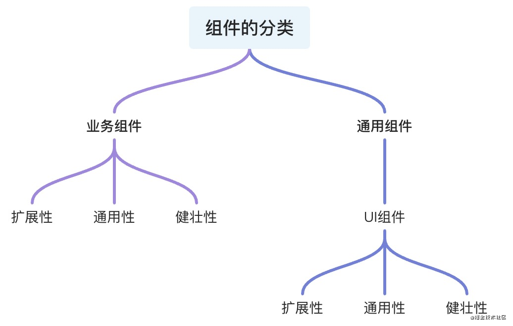

## vue组件设计

> 组件分为：
>
> + 业务组件
> + 通用组件
>   + ui组件



+ 扩展性：在原有组件基础可二次封装 扩展成新的组件符合设计的开闭原则
+ 通用性：根据组件接受的**参数**和**组件中与业务的解耦比**来衡量组件的通用性，并不是通用性占比100%的组件就是最好的组件，需要根据不同的场景分析
+ 健壮性：避免组件中**参数处理**和**函数执行过程**可能出现的奔溃和错误导致程序的直接挂断，单测以对组件内部做好边界处理，异常错误的捕获来衡量这一标准


**业务组件**

> 服务与业务的组件，分为页面级组件(page)、全局级别组件(componentes)


**组件封装考虑**

> vue和react推荐一个组件代码长度为200~500行

+ 组件的可维护性?
+ 组件的可读性？
+ 扩展性、健壮性、通用性
+ 组件是否需要封装抽离
+ 组件是否和业务强关联


**组件设计**

+ 容器组件		`处理业务相关逻辑，注册业务相关钩子，传入相应的数据和插槽`  （一般不可复用）
+ 视图组件        `数据的程序，交互的实现`


**组件和业务强关联?**

> 通常情况，组件中的大量数据来源 当前组件的接口请求。没有依赖或者几乎不依赖外部传入的props等，称为业务强关联组件，放弃组件封装的想法


### 组件案例

**react rc-switch组件**

```jsx
import * as React from 'react';
import classNames from 'classnames';
import useMergedState from 'rc-util/lib/hooks/useMergedState';
import KeyCode from 'rc-util/lib/KeyCode';

const Switch = React.forwardRef(
  (
    {
      prefixCls = 'rc-switch',
      className,
      checked,
      defaultChecked,
      disabled,
      loadingIcon,
      checkedChildren,
      unCheckedChildren,
      onClick,
      onChange,
      onKeyDown,
      ...restProps
    },
    ref,
  ) => {
    const [innerChecked, setInnerChecked] = useMergedState<boolean>(false, {
      value: checked,
      defaultValue: defaultChecked,
    });

    function triggerChange(
      newChecked: boolean,
      event: React.MouseEvent<HTMLButtonElement> | React.KeyboardEvent<HTMLButtonElement>,
    ) {
      let mergedChecked = innerChecked;

      if (!disabled) {
        mergedChecked = newChecked;
        setInnerChecked(mergedChecked);
        onChange?.(mergedChecked, event);
      }

      return mergedChecked;
    }

    function onInternalKeyDown(e) {
      if (e.which === KeyCode.LEFT) {
        triggerChange(false, e);
      } else if (e.which === KeyCode.RIGHT) {
        triggerChange(true, e);
      }
      onKeyDown?.(e);
    }

    function onInternalClick(e) {
      const ret = triggerChange(!innerChecked, e);
      // [Legacy] trigger onClick with value
      onClick?.(ret, e);
    }

    const switchClassName = classNames(prefixCls, className, {
      [`${prefixCls}-checked`]: innerChecked,
      [`${prefixCls}-disabled`]: disabled,
    });

    return (
      <button
        {...restProps}
        type="button"
        role="switch"
        aria-checked={innerChecked}
        disabled={disabled}
        className={switchClassName}
        ref={ref}
        onKeyDown={onInternalKeyDown}
        onClick={onInternalClick}
      >
        {loadingIcon}
        <span className={`${prefixCls}-inner`}>
          {innerChecked ? checkedChildren : unCheckedChildren}
        </span>
      </button>
    );
  },
);

Switch.displayName = 'Switch';

export default Switch;
```

**el-switch**

```vue
<template>
  <div
    class="el-switch"
    :class="{ 'is-disabled': switchDisabled, 'is-checked': checked }"
    role="switch"
    :aria-checked="checked"
    :aria-disabled="switchDisabled"
    @click.prevent="switchValue"
  >
    <input
      class="el-switch__input"
      type="checkbox"
      @change="handleChange"
      ref="input"
      :id="id"
      :name="name"
      :true-value="activeValue"
      :false-value="inactiveValue"
      :disabled="switchDisabled"
      @keydown.enter="switchValue"
    >
    <span
      :class="['el-switch__label', 'el-switch__label--left', !checked ? 'is-active' : '']"
      v-if="inactiveIconClass || inactiveText">
      <i :class="[inactiveIconClass]" v-if="inactiveIconClass"></i>
      <span v-if="!inactiveIconClass && inactiveText" :aria-hidden="checked">{{ inactiveText }}</span>
    </span>
    <span class="el-switch__core" ref="core" :style="{ 'width': coreWidth + 'px' }">
    </span>
    <span
      :class="['el-switch__label', 'el-switch__label--right', checked ? 'is-active' : '']"
      v-if="activeIconClass || activeText">
      <i :class="[activeIconClass]" v-if="activeIconClass"></i>
      <span v-if="!activeIconClass && activeText" :aria-hidden="!checked">{{ activeText }}</span>
    </span>
  </div>
</template>
<script>
  import emitter from 'element-ui/src/mixins/emitter';
  import Focus from 'element-ui/src/mixins/focus';
  import Migrating from 'element-ui/src/mixins/migrating';
  export default {
    name: 'ElSwitch',
    mixins: [Focus('input'), Migrating, emitter],
    inject: {
      elForm: {
        default: ''
      }
    },
    props: {
      value: {
        type: [Boolean, String, Number],
        default: false
      },
      disabled: {
        type: Boolean,
        default: false
      },
      width: {
        type: Number,
        default: 40
      },
      activeIconClass: {
        type: String,
        default: ''
      },
      inactiveIconClass: {
        type: String,
        default: ''
      },
      activeText: String,
      inactiveText: String,
      activeColor: {
        type: String,
        default: ''
      },
      inactiveColor: {
        type: String,
        default: ''
      },
      activeValue: {
        type: [Boolean, String, Number],
        default: true
      },
      inactiveValue: {
        type: [Boolean, String, Number],
        default: false
      },
      name: {
        type: String,
        default: ''
      },
      validateEvent: {
        type: Boolean,
        default: true
      },
      id: String
    },
    data() {
      return {
        coreWidth: this.width
      };
    },
    created() {
      if (!~[this.activeValue, this.inactiveValue].indexOf(this.value)) {
        this.$emit('input', this.inactiveValue);
      }
    },
    computed: {
      checked() {
        return this.value === this.activeValue;
      },
      switchDisabled() {
        return this.disabled || (this.elForm || {}).disabled;
      }
    },
    watch: {
      checked() {
        this.$refs.input.checked = this.checked;
        if (this.activeColor || this.inactiveColor) {
          this.setBackgroundColor();
        }
        if (this.validateEvent) {
          this.dispatch('ElFormItem', 'el.form.change', [this.value]);
        }
      }
    },
    methods: {
      handleChange(event) {
        const val = this.checked ? this.inactiveValue : this.activeValue;
        this.$emit('input', val);
        this.$emit('change', val);
        this.$nextTick(() => {
          // set input's checked property
          // in case parent refuses to change component's value
          this.$refs.input.checked = this.checked;
        });
      },
      setBackgroundColor() {
        let newColor = this.checked ? this.activeColor : this.inactiveColor;
        this.$refs.core.style.borderColor = newColor;
        this.$refs.core.style.backgroundColor = newColor;
      },
      switchValue() {
        !this.switchDisabled && this.handleChange();
      },
      getMigratingConfig() {
        return {
          props: {
            'on-color': 'on-color is renamed to active-color.',
            'off-color': 'off-color is renamed to inactive-color.',
            'on-text': 'on-text is renamed to active-text.',
            'off-text': 'off-text is renamed to inactive-text.',
            'on-value': 'on-value is renamed to active-value.',
            'off-value': 'off-value is renamed to inactive-value.',
            'on-icon-class': 'on-icon-class is renamed to active-icon-class.',
            'off-icon-class': 'off-icon-class is renamed to inactive-icon-class.'
          }
        };
      }
    },
    mounted() {
      /* istanbul ignore if */
      this.coreWidth = this.width || 40;
      if (this.activeColor || this.inactiveColor) {
        this.setBackgroundColor();
      }
      this.$refs.input.checked = this.checked;
    }
  };
</script>
```

### 组件命名规范

#### 组件文件

> **只要有能够拼接文件的构建系统，就把每个组件单独分成文件**

```tex
// bad
app.component('TodoList', {
  // ...
})

app.component('TodoItem', {
  // ...
})

// good
components/
|- TodoList.js
|- TodoItem.js
```


#### 单文件组件

> **单文件组件的文件名应该要么始终是单词大写开头 (PascalCase)，要么始终是横线连接 (kebab-case)**

```tex
// bad
components/
|- mycomponent.vue

components/
|- myComponent.vue

// good
components/
|- MyComponent.vue

components/
|- my-component.vue
```

#### 基础组件名称

> **应用特定样式和约定的基础组件 (也就是展示类的、无逻辑的或无状态的组件) 应该全部以一个特定的前缀开头，比如 `Base`、`App` 或 `V`**
>
> 条件限定：
>
> 这些组件为你的应用奠定了一致的基础样式和行为。它们可能**只**包括：
>
> - HTML 元素
> - 其它基础组件
> - 第三方 UI 组件库
>
> 但是它们**绝不会**包括全局状态 (比如来自 Vuex store)

```tex
// bad
components/
|- MyButton.vue
|- VueTable.vue
|- Icon.vue

// good
components/
|- BaseButton.vue
|- BaseTable.vue
|- BaseIcon.vue

components/
|- AppButton.vue
|- AppTable.vue
|- AppIcon.vue
```

#### 单组件名称

> **只应该拥有单个活跃实例的组件应该以 `The` 前缀命名，以示其唯一性。**
>
> 解释：这不意味着组件只可用于一个单页面，而是*每个页面*只使用一次。这些组件永远不接受任何 prop，因为它们是为你的应用定制的，而不是它们在你的应用中的上下文

```tex
// bad
components/
|- Heading.vue
|- MySidebar.vue

// good
components/
|- TheHeading.vue
|- TheSidebar.vue
```

#### 紧密耦合的组件名称

> **和父组件紧密耦合的子组件应该以父组件名作为前缀命名**

```tex
// bad
components/
|- TodoList.vue
|- TodoItem.vue
|- TodoButton.vue

components/
|- SearchSidebar.vue
|- NavigationForSearchSidebar.vue

// good
components/
|- TodoList.vue
|- TodoListItem.vue
|- TodoListItemButton.vue

components/
|- SearchSidebar.vue
|- SearchSidebarNavigation.vue
```


